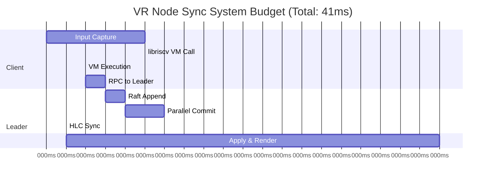

# Final Result: Task Dependency Graph

```mermaid
gantt
    title VR Node Sync System Budget (Total: 41ms)
    dateFormat X
    axisFormat %Lms

    section Client
    Input Capture           :a1, 0, 5
    libriscv VM Call        :a2, after a1, 0.003
    VM Execution            :a3, after a2, 2
    RPC to Leader           :a4, after a3, 3

    section Leader
    Raft Append             :a5, after a4, 4
    Parallel Commit         :a6, after a5, 6
    HLC Sync                :a7, after a6, 1

    section Client
    Apply & Render          :a8, after a7, 20
```

Total End-to-End Latency: 41ms

Critical Path: Input → VM → RPC → Raft → Commit → HLC → Render.
