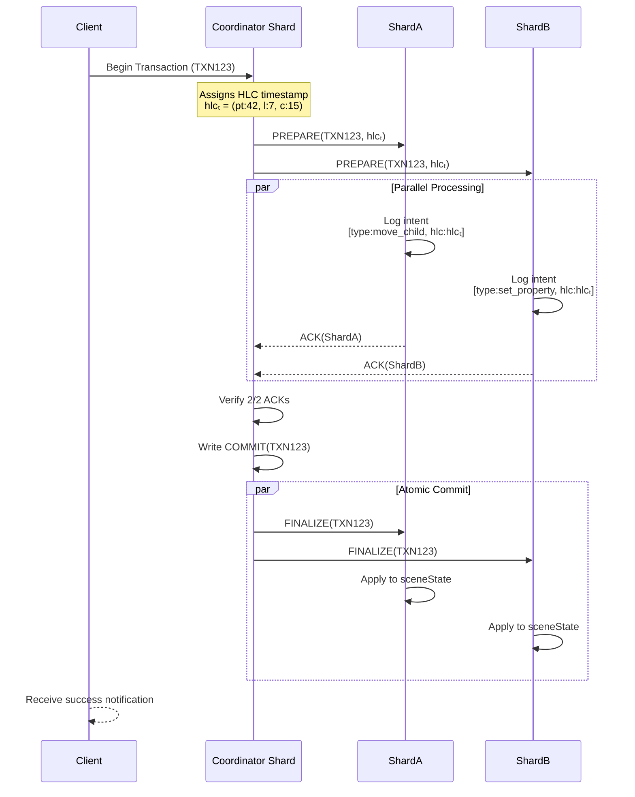

# Multi-Shard Scene Synchronization System

## Core Transaction Flow

**Core Architecture**  
The system partitions Godot node trees into shards managed by Raft consensus groups. Each shard elects a leader via Raft, handling nodes through static hashing (e.g., `node_id % num_shards`). Dynamic rebalancing uses explicit shard transfers to migrate node ranges between shards while preserving parent-child relationships. Hybrid Logical Clocks (HLCs) track physical/logical timestamps for global ordering, with components:

- **pt**: Synchronized with NTP
- **l**: Incremented on local operations
- **c**: Captures causal relationships
- **pc**: Persists prior physical time

**Operations & Conflicts**  
Scene modifications include atomic primitives like `AddChild`, `RemoveNode`, and batched `MoveSubtree`. Conflicts arise from:

1. **Structural overlaps**: Modifying ancestor/descendant nodes concurrently
2. **Write-write collisions**: Concurrent property updates
3. **Causal violations**: Out-of-order HLC timestamps  
   Resolution uses HLC-based last-write-wins for properties and dependency checks for structural changes.

**Transaction Protocol**  
Cross-shard transactions follow a coordinator-led two-phase commit:

1. **Prepare**: Lock involved shards, validate operation feasibility
2. **Commit**: Finalize via primary shard, propagate globally  
   Single-shard operations bypass coordination for direct Raft logging.

**Recovery & Consistency**  
Crashed nodes replay logs up to their shard’s commit index, reapplying uncommitted operations. Safety is enforced through:

- **Linearizability**: HLC order matches operation visibility
- **Tree integrity**: Automated orphan checks prevent detached subtrees
- **Atomicity**: Partial commits are rolled back via coordinator timeouts

**Optimizations**

- **Batched validation**: Parallel conflict checks for multi-op transactions
- **Shard-local fast path**: Single-shard ops skip 2PC overhead
- **HLC caching**: Reuse timestamps for related operations
